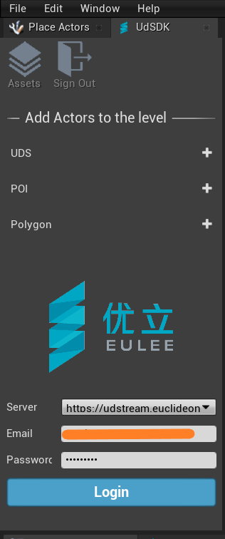

# UdSDK - Plugin for Unreal Engine<p align="right">[中文](https://github.com/zengweicheng666/UdSDKProject/blob/master/README(%E4%B8%AD%E6%96%87).md)</p>
This project demonstrates the use of UdSDK with the Unreal Engine Real Time Development Platform.

```
Language:              C#、C++
Type:                  Integration
Contributor:           UdSDK Development Team <support@euclideon.com>
Organization:          Euclideon, https://www.euclideon.com/
Date:                  2022-01-20
UdSDK Version:         1.0.0
Toolsets:              Requires Unreal Engine>= 4.27.1
```

## Quickstart guide 

__The Unreal-UdSDK sample requires a free Euclideon Account to use, licenses can be obtained [here](https://www.euclideon.com/udsdk/)__
<br>The UdSDK is tested with Unreal Engine in version 4.27.1. It may work in other versions of Unreal Engine, but no guarantee is provided for this. Please ensure you have the tested version installed.

### Preparation
1. Download and extract the latest udSDK package from [here](https://udstream.euclideon.com) using your license credentials. You can obtain a free account from [our website](https://www.euclideon.com/free-development-resources/) .
2. Clone the Unreal UdSDK examples from [here](https://git.euclideon.cn:3000/wesley.zeng/UdSDKProject.git) or Download as a zip.

3. Right click *UdSDKProject.uproject*, choose *Switch Unreal Engine version*, choose the version 4.27 and switch. You will obtain a *UdSDKProject.sln*.


4. Open the *UdSDKProject.sln* via Microsoft Visual Studio, compile and debug the project. After that an Unreal Engine Editor will pop up. Now you can see the plugin UdSDK in the editor.
<br>

### Other usage scenarios ###

1. __You can also apply the UdSDK to your projects.Just copy the plugin UdSDK from the folder *Plugins* in this sample into the folder *Plugins* in your project. (Create the folder *Plugins* by yourself when it does not exist).__

2. __You can also apply the UdSDK to the Unreal Engine in a certain version you are using. Just copy the plugin UdSDK from the folder *Plugins* in this sample into the folder *Marketplace* in the folder *Plugins* under the directory of the Unreal Engine in the target version. (Create the folder *Marketplace* by yourself when it does not exist). After that you can find the UdSDK in the Plugins Browser in the Unreal Editor.__
<br>


### Use UdSDK ###
__You can login to our server with the registered account to obtain the Uds model access.__
<br>

<br>**Assets**: Add a asset list to the Unreal Editor as needed. After you login to the server, the asset list obtains automatically assets or click *refresh* button to refresh assets.

<br>**UDS**: A Euclideon Unlimited Detail Point Cloud File. You can specify the url to assign a concrete point cloud model to the UDS actor.
<br>
<br>**POI**: A point, line or region describing a location of interest.
<br>**Polygon**: A polygon model, usually an OBJ or FBX.

## Basic Sample
1. Add an UDS actor，here use the url''https://models.euclideon.com.cn/udDemos/SouthEastQueeland/GoldCoast_20mm.uds''
<br>

2. Move
<br>

3. Rotate
<br>

4. Scale
<br>

5. Hide and display
<br>

6. You can change the color of the targets which are selected. It works after you click *Refresh Data*.
<br>


7. Add an Assets, it will lists assets that from the server after you click *fresh* button.
<br>
8. You can list assets in ascending or descending order by name, type or date added.
<br>
9. Search the name to find the target asset.
<br>
10.Add the asset to the level.
<br>


## Demo
__"Youli" demo is located in Plugins\UdSDK\Content\Youli under the directory of the project. The demo shows several uds models that were successfully loaded from the server to UE4 via the UdSDK in the form of exhibition hall.The uds models include the National Sports Museum, a quarry, a rain forest, a highway, FZSW and the Gold Coast. The demo introduces our company through scrolling subtitles on the screen besides.__

<p align="center">The panorama of the exhibition hall</p>

<br>

<p align="center">About our company</p>

<br>
<br>
<br>

<p align="center">The Gold Coast</p>

<br>

<p align="center">The rain forest</p>

<br>

<p align="center">The highway</p>

<br>

<p align="center">FZSW</p>

<br>

<p align="center">The National Sports Museum</p>

<br>

<p align="center">The quarry</p>

<br>
