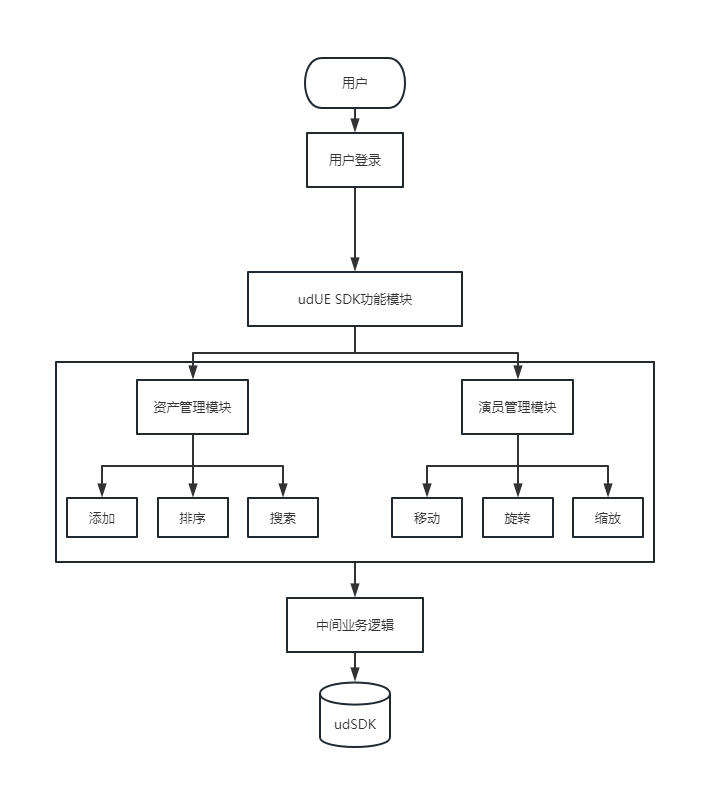

# 前言
__1.udUE SDK介绍__
  udUE SDK是三维引擎C#、C++库，提供基于UE虚幻引擎框架，开放优立无限细节渲染技术底层接口，为具备深层次开发能力的开发者提供最底层核心，客户可以基于此从最底层开发面向虚幻引擎的三维无限细节场景平台。
   __2.它是如何工作的？__
  **工作原理：** udUE SDK底层是基于OpenGL的udSDK，udSDK开放了优立无限细节渲染技术底层接口，将udSDK API、UE API和UE Slate封装成udUE SDK插件，加载该插件就可以在虚幻编辑器里应用udSDK所提供的底层核心。
  **工作逻辑图：**
 
   __3.系统环境要求__
  **系统版本要求：** Windows 10 64位版本或最新版的MacOS Ventura或Ubuntu 22.04
  **系统配置要求：**
 处理器：四核Intel或AMD处理器，2.5 GHz或更快
 内存：8 GB内存
 显卡：兼容DirectX 11或DirectX 12或Metal 1.2的显卡
  **Unreal Engine版本要求：** UdSDK在虚幻引擎4.27.1版本中测试过。此插件在虚幻引擎的其他版本中也可能正常运行，但并不能保证。请确保您已安装已成功测试的版本。
   __4.udUE SDK所涉及开发语言__
  udUE SDK开发涉及到C++和C#两大基础语言，C++用于开发udUE SDK的API和用户界面，C#用于给udUE SDK配置环境。
   __5.版本更新日志__
  **udUE SDK的版本** v1.0.0
 最新版本：v1.0.0
 更新时间：2022-01-20
